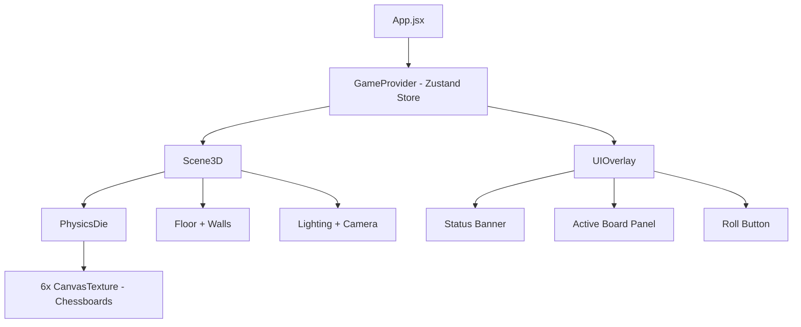
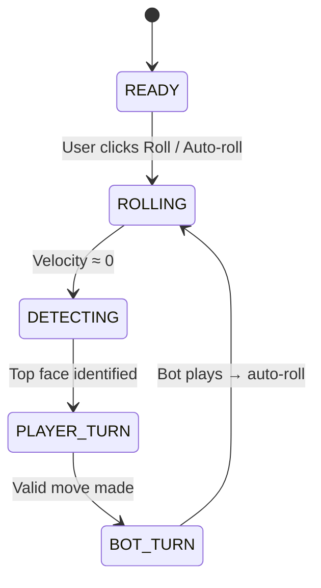

# DiceChess — 3D Web Application

A 3D die with 6 independent chess games mapped onto its faces. Roll the die, play on the top face, bot responds, repeat.

## Tech Stack

| Layer | Technology |
|---|---|
| Build | Vite + React |
| 3D Rendering | `@react-three/fiber` + `@react-three/drei` |
| Physics | `@react-three/cannon` (cannon-es) |
| Game Logic | `chess.js` |
| Styling | Vanilla CSS |

## Architecture Overview

## Core Design Decisions

### 1. Chessboard Rendering: Canvas Textures (not `<Html>`)

Using `<Html>` from drei would create 6 DOM overlays that rotate with the die — this causes severe z-fighting, interaction issues, and performance problems during physics animation. Instead, we will:

- Create 6 offscreen `<canvas>` elements (512×512 each)
- Draw each chessboard programmatically (squares, pieces as Unicode glyphs)
- Use `THREE.CanvasTexture` to map each canvas to a die face
- Update textures via `needsUpdate = true` after every move

> [!IMPORTANT]
> The chessboards on the die faces are **display-only**. User interaction happens via a **2D overlay panel** that appears when the die stops, showing the active board at full size with drag-and-drop piece movement.

### 2. Physics Die & Top-Face Detection

- Use `useBox` from `@react-three/cannon` with `mass: 5`
- Apply random impulse + torque on roll
- Detect rest state by monitoring velocity: when both `linearVelocity` and `angularVelocity` magnitudes drop below a threshold (~0.05) for several consecutive frames
- Determine top face using the **quaternion dot-product method**: transform 6 local face normals by the die's world quaternion, find the one with highest dot product against world-up `(0, 1, 0)`

### 3. Game State Machine

### 4. Bot Logic

Simple evaluation bot:
1. Get all legal moves from `chess.js`
2. Prioritize: checkmate > capture (by piece value) > check > random
3. 500ms delay before playing to let user see the board

---

## Proposed Changes

### Project Scaffold

#### [NEW] [package.json](file:///e:/Reste/DiceChess/package.json)
Vite + React project with dependencies:
- `react`, `react-dom`
- `@react-three/fiber`, `@react-three/drei`, `@react-three/cannon`, `three`
- `chess.js`
- `zustand` (lightweight state management)

#### [NEW] [vite.config.js](file:///e:/Reste/DiceChess/vite.config.js)
Standard Vite React config.

#### [NEW] [index.html](file:///e:/Reste/DiceChess/index.html)
Entry HTML with Google Font (Inter).

---

### Core Application

#### [NEW] [src/main.jsx](file:///e:/Reste/DiceChess/src/main.jsx)
React entry point, renders `<App />`.

#### [NEW] [src/App.jsx](file:///e:/Reste/DiceChess/src/App.jsx)
Top-level layout:
- `<Canvas>` wrapping the 3D scene
- `<UIOverlay>` for status, board panel, and roll button
- Global state provider

#### [NEW] [src/index.css](file:///e:/Reste/DiceChess/src/index.css)
Design system: dark theme, glass-morphism panels, smooth animations, typography.

---

### State Management

#### [NEW] [src/store/gameStore.js](file:///e:/Reste/DiceChess/src/store/gameStore.js)
Zustand store managing:
- `phase`: `READY | ROLLING | DETECTING | PLAYER_TURN | BOT_TURN`
- `games[0..5]`: array of 6 `Chess` instances (stored as FEN strings)
- `topFace`: index of the currently active face (0–5)
- Actions: `rollDie()`, `setTopFace(i)`, `makePlayerMove(move)`, `makeBotMove()`, `setPhase()`

---

### 3D Scene Components

#### [NEW] [src/components/Scene3D.jsx](file:///e:/Reste/DiceChess/src/components/Scene3D.jsx)
- `<Physics>` wrapper with gravity `[0, -30, 0]`
- `<PhysicsDie />`
- `<Floor />` — static `usePlane` body
- `<Walls />` — invisible boundary walls to keep die in view
- Lighting: ambient + 2 directional lights + soft shadows
- `<OrbitControls>` from drei (limited range)

#### [NEW] [src/components/PhysicsDie.jsx](file:///e:/Reste/DiceChess/src/components/PhysicsDie.jsx)
The main die component:
- `useBox` physics body (size `[2, 2, 2]`, mass 5, restitution 0.3, friction 0.7)
- 6 `CanvasTexture` materials (one per face), each rendering a chessboard
- `useFrame` loop to:
  - Monitor velocity for rest detection
  - Compute top face via quaternion normals
  - Trigger phase transitions
- `rollDie()` function: reset position to `[0, 8, 0]`, apply random impulse + angular velocity

#### [NEW] [src/components/Floor.jsx](file:///e:/Reste/DiceChess/src/components/Floor.jsx)
- `usePlane` static physics body
- Reflective dark material with grid pattern

---

### Chessboard Rendering

#### [NEW] [src/utils/drawChessboard.js](file:///e:/Reste/DiceChess/src/utils/drawChessboard.js)
Pure function: `drawChessboard(ctx, fen, faceIndex, isActive)`
- Draws 8×8 grid on a 512×512 canvas context
- Colors: elegant dark/light square palette
- Renders pieces as Unicode chess symbols (♔♕♖♗♘♙♚♛♜♝♞♟)
- Highlights active board with a glowing border
- Shows face index label in corner

#### [NEW] [src/utils/topFaceDetector.js](file:///e:/Reste/DiceChess/src/utils/topFaceDetector.js)
- `getTopFace(quaternion)` → returns face index 0–5
- Uses dot product of rotated face normals against world-up

---

### Bot & Game Logic

#### [NEW] [src/utils/botPlayer.js](file:///e:/Reste/DiceChess/src/utils/botPlayer.js)
- `getBotMove(fen)` → returns a move object
- Priority: checkmate > captures (weighted by MVV-LVA) > checks > random
- Returns `null` if game is over

---

### UI Components

#### [NEW] [src/components/UIOverlay.jsx](file:///e:/Reste/DiceChess/src/components/UIOverlay.jsx)
- **Status Banner**: Shows current phase ("Rolling...", "Your turn on Board #3", "Bot thinking...")
- **Roll Button**: Large animated button, only visible during `READY` phase
- **Active Board Panel**: Slides in from the right during `PLAYER_TURN`
  - Full-size interactive chessboard (drawn on canvas with click-to-move)
  - Shows legal moves as highlighted squares
  - Click source square → highlights destinations → click destination to confirm
  - Piece promotion dialog when applicable

#### [NEW] [src/components/ActiveBoardPanel.jsx](file:///e:/Reste/DiceChess/src/components/ActiveBoardPanel.jsx)
- Interactive 2D chessboard overlay for making moves
- Canvas-based with mouse event handling
- `onClick` → compute square from coords → select/move logic
- Syncs with zustand store

---

## Face-Index Mapping

Three.js `BoxGeometry` material indices:

| Index | Face | Local Normal |
|---|---|---|
| 0 | +X (Right) | `(1, 0, 0)` |
| 1 | -X (Left) | `(-1, 0, 0)` |
| 2 | +Y (Top) | `(0, 1, 0)` |
| 3 | -Y (Bottom) | `(0, -1, 0)` |
| 4 | +Z (Front) | `(0, 0, 1)` |
| 5 | -Z (Back) | `(0, 0, -1)` |

---

## Verification Plan

### Automated Tests
- `npm run dev` → verify the app loads without errors in browser console
- Visual inspection of die rolling physics
- Verify top-face detection accuracy by manually comparing displayed face vs visual

### Manual Verification
- Roll 5+ times and confirm correct board activates each time
- Play several moves on different boards and verify game state persistence
- Confirm bot plays valid responses
- Verify game-over states (checkmate, stalemate) are handled gracefully
- Test responsiveness on different window sizes

### Browser Testing
- Use the browser subagent to navigate to `localhost:5173`
- Verify the 3D scene renders
- Test the game loop end-to-end
