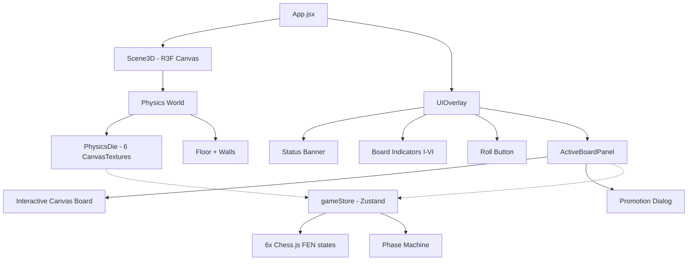

# DiceChess — Walkthrough

## What Was Built

A 3D web application where a physics-driven die has 6 independent chess games mapped onto its faces. The core game loop: **roll → stop → play on top face → bot responds → auto-roll**.

## Architecture



## Key Files

| File | Purpose |
|---|---|
| [gameStore.js](file:///e:/Reste/DiceChess/src/store/gameStore.js) | Zustand store: 6 FEN states, phase machine, selection logic, promotion |
| [PhysicsDie.jsx](file:///e:/Reste/DiceChess/src/components/PhysicsDie.jsx) | Physics body + 6 canvas textures + rest detection + top-face computation |
| [drawChessboard.js](file:///e:/Reste/DiceChess/src/utils/drawChessboard.js) | Canvas renderer: pieces (Unicode), legal moves, check/selection highlights |
| [topFaceDetector.js](file:///e:/Reste/DiceChess/src/utils/topFaceDetector.js) | Quaternion dot-product algorithm to find upward-facing face |
| [botPlayer.js](file:///e:/Reste/DiceChess/src/utils/botPlayer.js) | Priority bot: checkmate > captures (MVV-LVA) > checks > center > random |
| [ActiveBoardPanel.jsx](file:///e:/Reste/DiceChess/src/components/ActiveBoardPanel.jsx) | Full-size interactive board overlay with click-to-move |
| [UIOverlay.jsx](file:///e:/Reste/DiceChess/src/components/UIOverlay.jsx) | Status bar, board indicator badges, roll button, bot turn automation |

## Game Loop

```
READY → (click Roll) → ROLLING → (velocity ≈ 0) → DETECTING → (top face found) → PLAYER_TURN
  → (user clicks piece, then target) → BOT_TURN → (bot plays after 600ms) → ROLLING → ...
```

## Verification

### Browser Testing Results

All core requirements verified ✅:
- 3D physics-based dice rolling with cannon-es
- 6 independent chess.js instances mapped to cube faces via CanvasTexture
- Top-face detection via quaternion normals
- Interaction locked to top face only
- Click-to-move piece selection with legal move indicators
- Bot plays opponent response automatically
- Auto-roll after bot turn completes

### Screenshots

````carousel

<!-- slide -->

<!-- slide -->

````

### Recording


